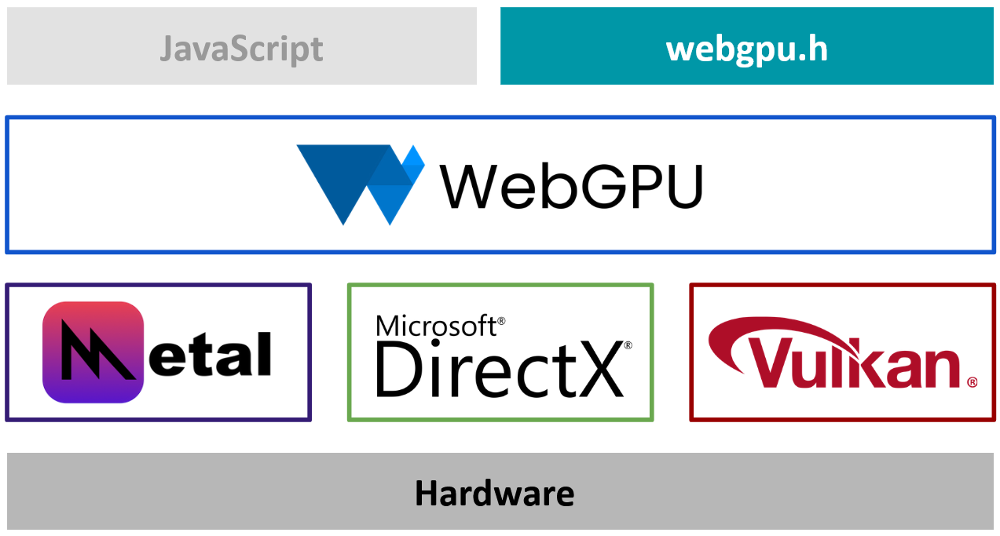

# WebGPU

## 什么是 WebGPU

WebGPU 是一种渲染硬件接口（Render Hardware Interface），构建在驱动程序 / 操作系统提供的各种API之上，下面的图片显示了 WebGPU 与由 GPU 硬件厂商支持的图形 API 之间的关系。

简单的说，WebGPU 就是把更底层的新一代 API 进行统一和封装，我觉得这样的好处有：
1. 无感图形 API 和操作系统 的差别，因为一般而言，Windows 使用 DX / VK，Linux / Android 使用 VK，IOS 使用 Metal
2. 有几大浏览器厂商提供支持，通过浏览器跨平台能力会更强

## WebGPU 的实现

WebGPU 只是 RHI，只要符合接口标准，都是可行的，目前有两大实现

1. (wgpu-native)[https://github.com/gfx-rs/wgpu-native]，这是由  Firefox 基于 Rust 实现的
2. (Dawn)[https://dawn.googlesource.com/dawn]，由谷歌实现
